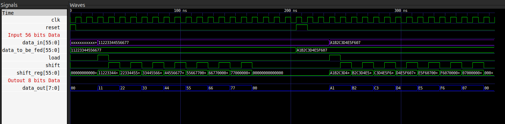

## (3) Data Feeders  

**1. Why we used them?**  
We have already described the processing element. Now, since we are using a **4×4 systolic array**, a total of **16 processing elements** will be used.  

- Each processing element takes **8-bit input**.  
- However, we have **7 elements** in a row/column (as per the systolic array architecture).  
- This makes it **7 × 8 = 56 bits**.  

A simple solution is to use **data feeders**, in which we feed **56-bit row/column** data and get **8-bit elements** by shifting them one by one, which are then fed to the respective registers.  

### 2. PinOut

**Inputs:**
- `data_in` – 56-bit input row/column data.  
- `load` – Load signal to initialize the feeder.  
- `shift` – Shift signal to move data one element at a time.  
- `reset` – Resets the internal state of the feeder.  

**Outputs:**
- `data_out` – 8-bit output element, fed to the respective registers.  

### 3. Design Diagram
  <!-- Replace with your actual file -->

### Explanation
- The `in_width` (i.e., `data_in`) is stored in a **register** whenever `load` is high and `reset` is off.  
- When the **shift** signal is high, the register shifts data from the **Most Significant Bit (MSB)**.  
- This process produces **seven 8-bit chunks**, which are then fed to the **Processing Elements** as individual elements of a row/column.  
- These seven 8-bit chunks form the **out_width**, which corresponds to `data_out`.  

### Simulations:

---
