# 4x4 INT Systolic Architecture Based Accelerator for Efficient Matrix Multiplication

## Plan
The documentation is divided into two main sections:

- **User’s Guide**: Includes everything needed to *use* the chip.  
- **Developer’s Guide**: Contains complete details of the chip, including internal signals, STGs, diagrams, etc. This section is made so that anyone who wants to integrate the chip into their own design can do so using this documentation.  

---

# User Guide

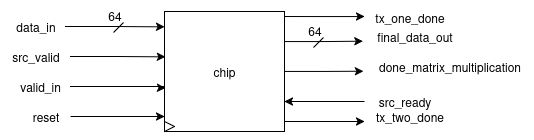  

- The array takes an **input of 64 bits** and gives an **output of 64 bits**.  
- This I/O is communicated using the **bidirectional ready-valid protocol**.  
- The bits have a predefined format according to which they are received/transmitted.  

**Matrix Transfer Format**
[1st  2nd  3rd  4th ]
[5th  6th  7th  8th ]
[9th  10th 11th 12th]
[13th 14th 15th 16th]

**Input format:**  
- [63:32] → row (8 bits per element)[4 elements]
- [31:0] → column (8 bits per element)[4 elements]


**Output format:**  
[2 × (32-bit elements)]


---

### How to Give Input?
- Provide **four chunks of 64-bit input** where:  
  - `[63:32]` contains the *i-th row*  
  - `[31:0]` contains the *j-th column*  
- In this way, each row/column will be **32 bits**, and each element will be **8 bits** (since `8 × 4 = 32`).  
- These I/Os follow the **ready-valid protocol**:  
  - At the input end → **valid** is expected from the end user.  
  - At the output end → **ready** is expected from the end user.  

---

### Final Transfer
- Recognized with the **`done_matrix_multiplication` flag** being set.  
- This indicates:  
  1. The availability of the final two elements from the array.  
  2. The chip has returned to its **idle state** and is ready to accept new inputs.  

---

## Getting Started
Clone our repository:

git clone [https://github.com/ee-uet/systolic-MAC.git](https://github.com/ee-uet/systolic-MAC.git)

---

# Developer’s Guide

## Conceptual Overview

### What is a Systolic Array?
- In parallel computer architectures, a **systolic array** is a homogeneous network of tightly coupled **data processing units (DPUs)** called *cells* or *nodes*.  
- Each node or DPU:
  - Independently computes a partial result as a function of the data received from its upstream neighbours.  
  - Stores the result within itself.  
  - Passes it downstream.  


---

### Applications of Systolic Arrays
🔹 **Deep Learning Accelerators (ML)**  
Efficiently perform parallel matrix multiplications in neural networks like **CNNs** and **Transformers**.  

🔹 **Image & Signal Processing (DSP)**  
Enable real-time convolution operations for filtering, edge detection, and motion estimation.  

🔹 **DNA Sequence Alignment (Biology)**  
Accelerate alignment algorithms like **Smith-Waterman** using parallel dataflow for fast genome matching.  

🔹 **MIMO Signal Processing (DSP/Comms)**  
Support high-throughput matrix operations for channel equalization and beamforming in wireless systems.  

...and much more.  

---

## Main Parts of a Systolic Array

## 1. MAC Unit
- In computing, especially digital signal processing, the **Multiply–Accumulate (MAC)** or **Multiply–Add (MAD)** operation is a common step that:  
  - Computes the product of two numbers.  
  - Adds that product to an accumulator.  

- The MAC operation modifies an accumulator `y`:  
```math
y ← y + (a × b)
```

 For simplicity, in **C code**:  
```c
y += (a * b);
```

- General CPUs are used in **Von Neumann architecture**, but **digital signal processors (DSPs)** use **MACs**.  
- The hardware unit that performs the operation is known as a **Multiplier–Accumulator (MAC Unit)**.  

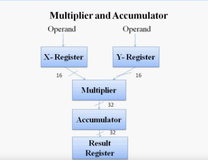  <!-- Replace mac_unit.png with your actual file -->

## 2. Processing Elements / Data Processing Units

- A **Processing Element (PE)**, also called a **Data Processing Unit (DPU)**, is the fundamental building block of a systolic array.  
- Each PE is designed to perform simple operations such as:  
  - Addition  
  - Multiplication  
  - MAC (Multiply–Accumulate)  
- PEs are connected to their neighbors in a regular pattern, allowing data to **flow step by step**.  
- Together, many PEs work in parallel to achieve high throughput in matrix and vector computations.  

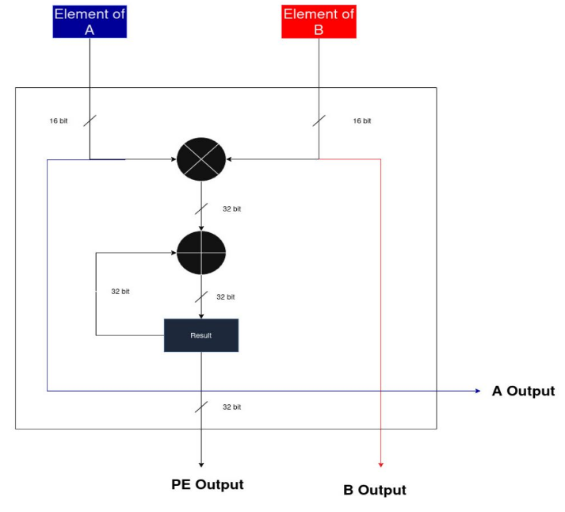  <!-- Replace processing_element.png with your actual file -->

## 3. Systolic Array

- A **systolic array** is a grid of interconnected **Processing Elements (PEs)** arranged in rows and columns.  
- Data pulses rhythmically through the array like **blood through the heart** (hence the name *“systolic”*).  
- The structure enables efficient **parallel computation of linear algebra operations**, especially:  
  - Matrix multiplication  
  - Convolution  

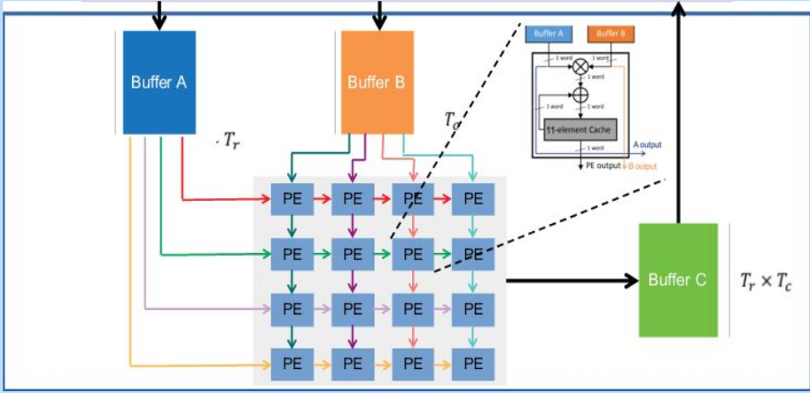  <!-- Replace systolic_array.png with your actual file -->


# DESIGN OVERVIEW

## Specialty & Performance

- We built the entire **Systolic Array** completely from scratch, covering all modules and interconnections.  
- On a **3 GHz machine**, the full computation completed in just **~15 ns**.  
- This results in a performance that is nearly **50-160** times faster than a general purpose cpu(check the benchmarks section). 

---

# Explanation of Our Design

---

## (1) MAC Unit

### 1. PinOut
.png)  <!-- Replace mac_pinout.png with your actual file -->

### Inputs
- Takes the following as inputs:  
  - **valid**  
  - **A** (8-bit element of matrix)  
  - **B** (8-bit element of matrix)  
  - **reset**  

### Outputs
- Provides the following as outputs:  
  - **y** → 32-bit result  
  - **done** → 1-bit signal which goes high whenever `y` is valid, indicating that the MAC unit has completed the operation.  

### 2. Design Diagram

.png)  <!-- Replace mac_design.png with your actual file -->

### Explanation
- First of all, the user enters elements **A** and **B**.  
- As soon as **reset** is off and **valid** becomes high:  
  - `en_A` and `en_B` go high.  
  - The user-entered **A** and **B** values are stored in their respective registers: `reg_A` and `reg_B`.  
- Then:  
  - Both values are multiplied.  
  - The result is added to the previous result (principle of **MAC**).  
- A register named **reg_Acc** stores the result whenever `en_Acc` goes high.  
  - *(When `en_Acc` goes high will be explained in the STG section.)*  
- Since both input elements are **8 bits**:  
  - Multiplication produces a **16-bit** result.  
  - This result is padded to **32 bits** → giving output `y` as **32 bits**.  
- As soon as the result `y` is obtained, the **done** signal goes high.  


### 3. Register Design

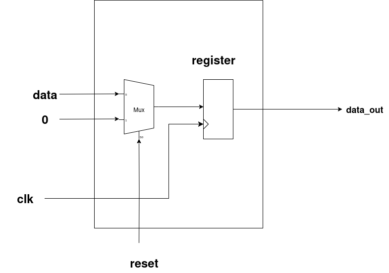  <!-- Replace register_design.png with your actual file -->

- This is the **general register design** used for all the registers in our system.  
- First, a **2×1 MUX** is used, whose output is stored into a register.  
- The **selector pin** of the MUX is `reset`.  
- Behavior:  
  - When **reset = 0 (off)** → The MUX selects input **data**, which is stored in the register. The corresponding `data_out` is available in the next cycle.  
  - When **reset = 1 (high)** → The MUX selects **zero**, and hence the register outputs `0` as `data_out`.  


### 4. State Transition Graph (STG)

.png)  <!-- Replace mac_stg.png with your actual file -->

### Explanation

#### I. IDLE
- Whenever **reset = 1**, the system enters the **IDLE** state:  
  - All register enables are low.  
  - `done = 0`.  
- It **remains in IDLE** if `valid = 0`.  
- When a **valid** signal is received, it transitions to the **LOAD** state.  

#### II. LOAD
- In this state:  
  - Enables of **reg_A** and **reg_B** go high → user inputs are stored in `reg_A` and `reg_B`.  
  - **reg_Acc** is still off (no computation yet).  
  - `done = 0` since no result is available yet.  
- Next, it transitions to the **PROCESSING** state.  

#### III. PROCESSING
- In this state:  
  - **reg_A** and **reg_B** enables go low (to hold current inputs and avoid taking new ones).  
  - **reg_Acc** enable goes high → computation starts, and result is stored in the accumulator.  
  - `done = 0` since computation is still ongoing.  
- Next, it transitions to the **DONE** state.  

#### IV. DONE
- In this state:  
  - **en_A** and **en_B** remain off.  
  - **en_Acc** stays on.  
  - The **done signal = 1** → indicating completion of computation.  
- Finally, it transitions back to **IDLE**, and the cycle continues.  

---

## (2) PROCESSING ELEMENT (PE)

### PinOut:
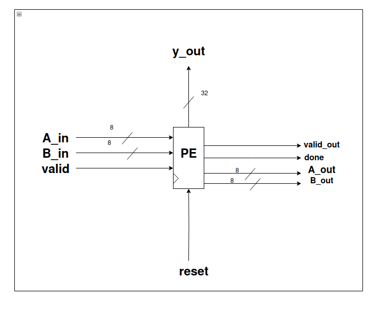

**Inputs:**
- `valid`, `reset`, `A_in`, `B_in` as inputs.  
- `A_in`, `B_in` are 8-bit signals.  

**Outputs:**
- `A_out`, `B_out`, `done`, `valid_out`, `y_out`.  
- `A_out`, `B_out` are 8-bit signals.  
- `done` goes high whenever the MAC operation completes.  
- `valid_out` goes high whenever the overall PE operation completes.  
- `y_out` is the 32-bit output of the PE.  


### 2. Design Diagram
.png)

### Explanation:
- **Step 1:** `A_in`, `B_in`, `valid`, and `reset` go to the **MAC unit** and process the same way as explained earlier.  
- **Step 2:** From the MAC unit, we get `y` and `done` as outputs.  
  - `done` indicates that the MAC process has been completed.  
  - This `done` signal is passed through a **counter** (design explained below).  
  - When the counter registers **7 occurrences of `done`**, the `valid_out` flag becomes high, showing that the PE’s computations are complete.  
- **Step 3:** The `valid_out` also connects to a register. When we get **7 outputs of `y`** from the MAC unit, it confirms that the PE’s calculations are finished, and finally, `y_out` (32 bits) is produced.  

---

#### Why count 7 times?  
- In the **Systolic Array Architecture**, after padding, the last row and last column expand into **7 elements**:  
  - 4 actual elements  
  - 3 padded zeros  
- Therefore, we must count **7 `done` signals** to ensure that the row/column computation has finished correctly.  

---

#### Role of `A_out` and `B_out`  
- Whenever the `done` signal goes high, `A_in` and `B_in` are stored in `reg_A` and `reg_B`.  
- These values then propagate outward as `A_out` and `B_out`.  

---

#### Why are `A_out` and `B_out` needed?  
- In the systolic array, each PE must process **7 elements per row/column**.  
- In a **4×4 systolic array**, there are **16 Processing Elements (PEs)** working in parallel.  
- To enable this **parallel pipelined computation**, each PE forwards `A_out` and `B_out` to its neighbors.  
- This design ensures faster computations by reducing the number of cycles required.  


---

### Counter

### I. PinOut:
.png)

**Inputs:**
- `reset` – Resets the counter.  
- `done` – Input pulse that needs to be counted.  

**Outputs:**
- `en_y` – Goes high when the counter completes **7 counts**.  

### II. Design Diagram
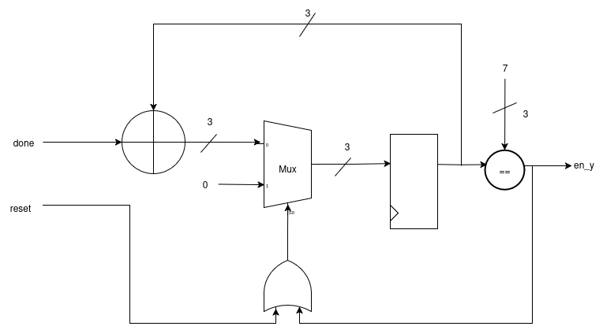

### Explanation
- The input signal (`done`) is added to the previous result.  
- The **previous result** is selected by a **Mux**.  
- The **selector pin** of the Mux is driven by the **OR** of `reset` and `en_y`.  
  - If `reset` is high **or** `en_y` is high (count complete), the Mux passes **zero**.  
  - Otherwise, it passes the actual input to be stored in the **register**.  
- A **comparator** checks each result.  
- When the count reaches **7**, the comparator output goes high, raising `en_y`.  


---

## (3) Data Feeders  

**1. Why we used them?**  
We have already described the processing element. Now, since we are using a **4×4 systolic array**, a total of **16 processing elements** will be used.  

- Each processing element takes **8-bit input**.  
- However, we have **7 elements** in a row/column (as per the systolic array architecture).  
- This makes it **7 × 8 = 56 bits**.  

A simple solution is to use **data feeders**, in which we feed **56-bit row/column** data and get **8-bit elements** by shifting them one by one, which are then fed to the respective registers.  


### 2. PinOut
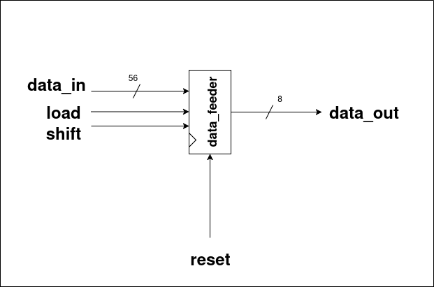

**Inputs:**
- `data_in` – 56-bit input row/column data.  
- `load` – Load signal to initialize the feeder.  
- `shift` – Shift signal to move data one element at a time.  
- `reset` – Resets the internal state of the feeder.  

**Outputs:**
- `data_out` – 8-bit output element, fed to the respective registers.  


### 3. Design Diagram
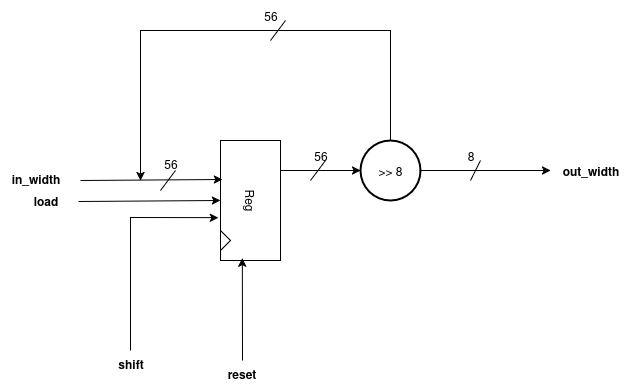  <!-- Replace with your actual file -->

### Explanation
- The `in_width` (i.e., `data_in`) is stored in a **register** whenever `load` is high and `reset` is off.  
- When the **shift** signal is high, the register shifts data from the **Most Significant Bit (MSB)**.  
- This process produces **seven 8-bit chunks**, which are then fed to the **Processing Elements** as individual elements of a row/column.  
- These seven 8-bit chunks form the **out_width**, which corresponds to `data_out`.  

---


## (4) Systolic Top

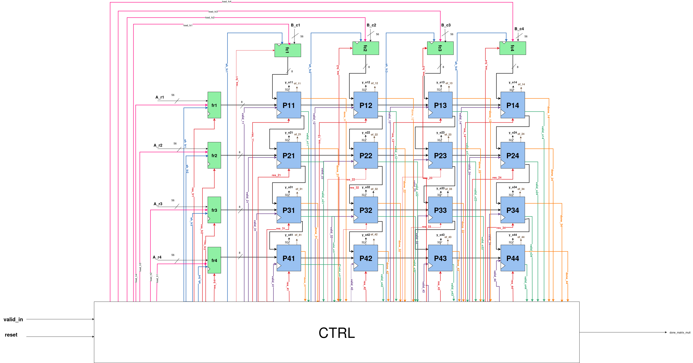  <!-- Replace with your actual image -->

- This is how our **Systolic Array Top** looks after connecting all the **Processing Elements** and **Data Feeders**.  
- To use this array, a **proper interface** is required, which is explained in the following sections.  

---

## (5) Interface 

#### 1. Interface Design Diagram
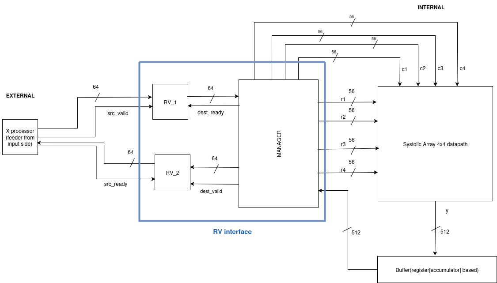  <!-- Replace with your actual image -->


**Main Parts of Interface:**
1. **Ready-Valid Protocol**  
2. **Input Manager**  
3. **Output Manager**  


---
### EXPLANATION

### 1. READY-VALID PROTOCOL

#### PinOut
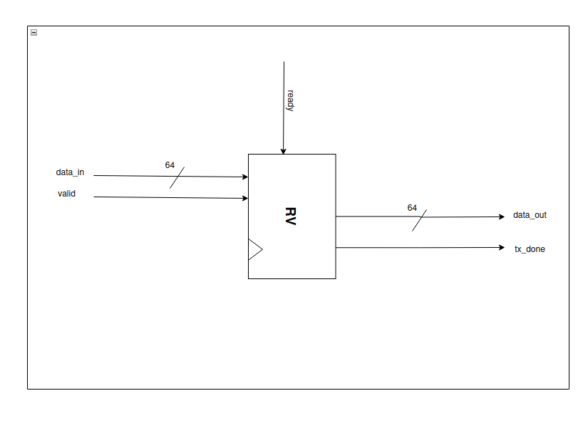

**Inputs:**
- `ready` – Indicates that the receiver is ready to accept data.  
- `valid` – Indicates that the sender has valid data.  
- `data_in` – 64-bit input data.  

**Outputs:**
- `data_out` – 64-bit output data.  
- `tx_done` – Goes high whenever `data_out` is successfully transmitted.  

### Design Diagram
  <!-- Replace with your actual image -->

### Explanation
- Whenever **valid** becomes high, `data_in` is received.  
- When both **valid** and **ready** are high:  
  - `en_data_Tx` goes high → handshaking occurs.  
  - `data_out` is produced in the next cycle (64 bits).  
- `tx_done` signal goes high whenever the respective `data_out` is available.  

#### How does `tx_done` work?
- `en_data_Tx` goes high when handshaking occurs.  
- A **multiplexer (MUX)** uses `en_data_Tx` as the select signal.  
  - When `en_data_Tx = 1`, the MUX outputs 1.  
  - This output passes through a **delay register**, producing `tx_done` in the next clock cycle.  

#### Why use a delay register?
- Without the delay register, `tx_done` would assert **one cycle earlier** than the availability of `data_out`.  
- The delay register ensures `tx_done` aligns with the exact cycle when `data_out` is valid, confirming the output data is ready.  

### State Transition Graph (STG)
.png)  <!-- Replace with your actual image -->

### Explanation

#### I. IDLE
- On **reset**, the system enters the **IDLE** state.  
- If either `valid` or `ready` is low, the system **remains in IDLE**.  
- When both `valid` and `ready` are high, **handshaking occurs**, and the system transitions to the **Tx** state.  

#### II. Tx
- In this state, `valid` and `ready` being high indicate that **handshaking has occurred**.  
- The `en_data_Tx` signal is asserted (goes high), initiating the **data transfer**.  
- Immediately after this, the system **returns to the IDLE** state.  


---

### 2. INPUT MANAGER

#### PinOut
.png)

**Inputs:**
- `data_in` – 64-bit input data.  
- `next_row` – Signal to indicate the next row of the matrix.  
- `next_col` – Signal to indicate the next column of the matrix.  

**Outputs:**
- `A_r1`, `A_r2`, `A_r3`, `A_r4` – 56-bit outputs for rows 1 to 4.  
- `B_c1`, `B_c2`, `B_c3`, `B_c4` – 56-bit outputs for columns 1 to 4.  
  - Each row/column has **7 elements**, and each element is **8 bits** → 7 × 8 = 56 bits.  

**Working:**  
- The Input Manager is **combined with the input datapath**, which is explained in the following section.  

---

### 3. OUTPUT MANAGER

#### PinOut
.png)

**Inputs:**
- `load` – Signal to load the input data.  
- `shift` – Signal to shift the data.  
- `reset` – Resets the internal state of the output manager.  
- `data_in` – 512-bit input data (`y` from processing elements).  

**Outputs:**
- `data_out` – 64-bit output data, produced **eight times** from the 512-bit input.  


### Design Diagram
.png)

### Explanation
- The **Systolic Array** produces **512 bits** output (16 PEs × 32 bits each).  
- These 512 bits serve as `data_in`/`y` for the **Output Manager**.  
- The Output Manager acts like a **data feeder**, mainly implemented as a **shift register**.  
- The **first 64 bits** are taken from the **MSB side** when `load` is high.  
- For the remaining seven 64-bit chunks:  
  - Wait for the `shift` signal.  
  - Each time `shift` goes high, the next 64-bit chunk is produced as `data_out`.  
- In this way, the **eight 64-bit outputs** are obtained sequentially.  


---

## (6) Systolic Array
.png)  <!-- Replace with your actual image -->

### Main Parts of the Systolic Array
Our final **Systolic Array** consists of three main parts:

1. **Input Datapath**  
2. **Systolic Top**  
3. **Output Datapath**  

---
### EXPLANATION

### 1. Input DataPath
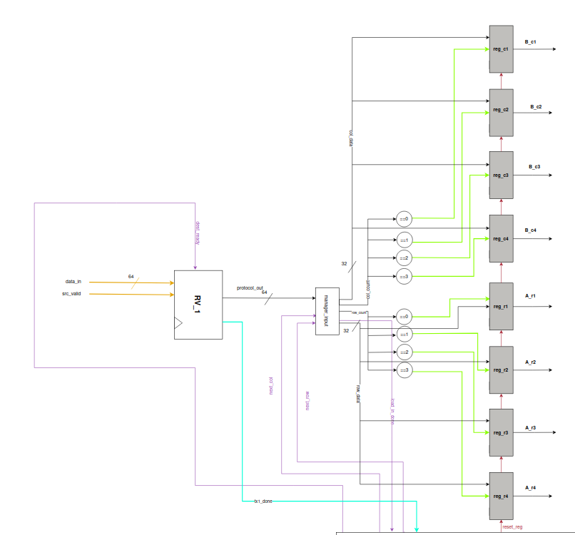  <!-- Replace with your cropped image -->

### Explanation
- The user provides a **64-bit input**, which first enters the **Ready–Valid Protocol (RV_1)**.  
- When both `src_valid` and `dest_ready` are high, **handshaking occurs**, producing:  
  - `protocol_out` → the same 64-bit input  
  - `tx1_done` → generated in the next cycle  

- The 64-bit `protocol_out` is passed to the **Output Manager**, where it is split into two 32-bit parts:  
  - `[63:32]` → row data  
  - `[31:0]` → column data  

- **Row_count** and **col_count** act as enables for registers `reg_ri` and `reg_cj` (`i,j = 0 to 3`)  

- **First row/column:**  
  - `row_count = col_count = 0` → stored in `reg_r1` and `reg_c1`  

- **Subsequent rows/columns:**  
  - When `next_row` and `next_col` go high, `row_count` and `col_count` increment.  
  - Values are stored in `reg_r2`/`reg_c2`, `reg_r3`/`reg_c3`, and `reg_r4`/`reg_c4`.  

- When `row_count` and `col_count = 3`, all **four rows and columns** are captured.  
  - `load_in_done` signal is asserted → indicates all inputs have been successfully loaded  

- **Registers holding the values:**  
  - Rows: `reg_r1`, `reg_r2`, `reg_r3`, `reg_r4`  
  - Columns: `reg_c1`, `reg_c2`, `reg_c3`, `reg_c4`  

- **56-bit outputs generated from registers:**  
  - Rows: `A_r1`, `A_r2`, `A_r3`, `A_r4`  
  - Columns: `B_c1`, `B_c2`, `B_c3`, `B_c4`  

- These values are finally fed into the **data feeders** of the Systolic Array.  

### Simulations
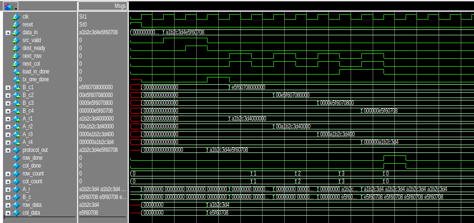  <!-- Replace with your waveform image -->


---

### 2. Systolic Top
  <!-- Replace with your cropped image -->

### Explanation
- The **four rows** and **four columns** are fed into the **data feeders**, which pass them to the **Processing Elements (PEs)** as described earlier.  
- Each PE produces a **32-bit output (`y_out`)**.  
- Using a **4×4 systolic array**, there are **16 PEs**, resulting in a combined output of:  
  - `16 × 32 = 512 bits`  
  - This output is referred to as **`y`**.  
- The **512-bit `y`** is then passed to the **Output Datapath**, where it is organized into **eight 64-bit chunks**, forming the final output. (Because `64 × 8 = 512`)  


---

### 3. Output DataPath
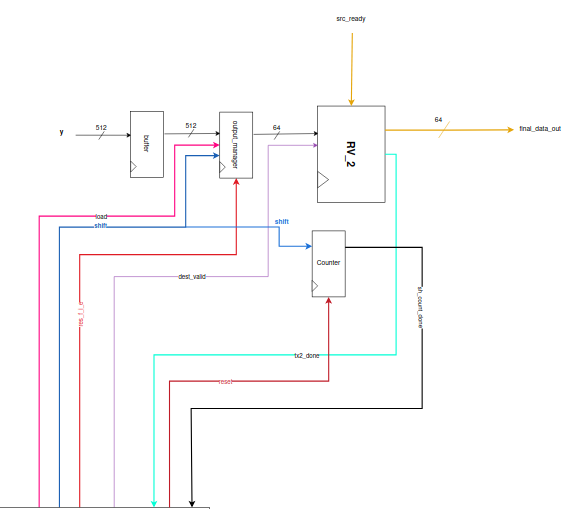  <!-- Replace with your cropped image -->

### Explanation
- The **512-bit `y`** from the Systolic Top is first stored in a **buffer** (simple register), which outputs the stored value in the next cycle.  
- This 512-bit data is then sent to the **Output Manager**, where it waits for the **load** signal.  

- When **load** is asserted:  
  - The **first 64 bits** (from the MSB side) are sent to the **Ready–Valid Protocol (RV_2)**.  
  - When both `dest_valid` and `src_ready` are high in RV_2, **handshaking occurs**:  
    - `final_data_out` → first 64-bit output chunk  
    - `tx2_done` → asserted to indicate successful transfer  

- After the first `final_data_out`:  
  - The **shift** signal from the Output Manager is asserted.  
  - The next 64-bit chunk is shifted out and sent to **RV_2**.  
  - Handshaking occurs again → second 64-bit `final_data_out` with `tx2_done`.  

- This process continues:  
  - A total of **7 shifts** occur → 8 final outputs of 64 bits each.  
  - Since `8 × 64 = 512`, the entire Systolic Array output is successfully transferred.  

- The **7 shift events** are monitored by a **Counter**:  
  - Counts up to 7 shifts.  
  - Once all shifts are completed, `sh_count_done` is asserted → indicates **entire computation and output transfer complete**.  

### Simulations
  <!-- Replace with your waveform image -->


---

### COUNTER

#### PinOut
.png)

**Inputs:**
- `enable` – Starts the counting process.  
- `reset` – Resets the counter to its initial state.  

**Outputs:**
- `count_done` – Goes high when counting is complete.  


### Design Diagram
.png)

### Explanation

#### Reset Phase
- When `rst = 1`:  
  - The counter (`count`) is cleared to **0**.  
  - `count_done` signal is also cleared to **0**.  

#### Normal Operation (when `rst = 0`)
- On every **posedge of clk**, the counter checks the `enable` signal:  
  - If `enable = 0` → counter holds its current value (no change).  
  - If `enable = 1`:  
    - The counter **increments by 1**.  
    - While `count < count_limit - 1`:  
      - Only `count` updates  
      - `count_done` remains **0**  
    - When `count = count_limit`:  
      - `count_done` asserts (**1**) for **one clock cycle**  
      - The counter immediately **resets back to 0**  

#### Key Behavior
- Counts **clock cycles** when enabled.  
- After completing `count_limit` cycles, it raises a **1-cycle done pulse** (`count_done`).  
- The process **repeats** as long as `enable` remains asserted.  


---

## FINAL SYSTOLIC ARRAY

#### Design Diagram
We have connected all three main parts to get the overall **final Systolic Array** as shown below:  
.png)  <!-- Replace with your actual image -->


### State Transition Graph (STG) of Controller
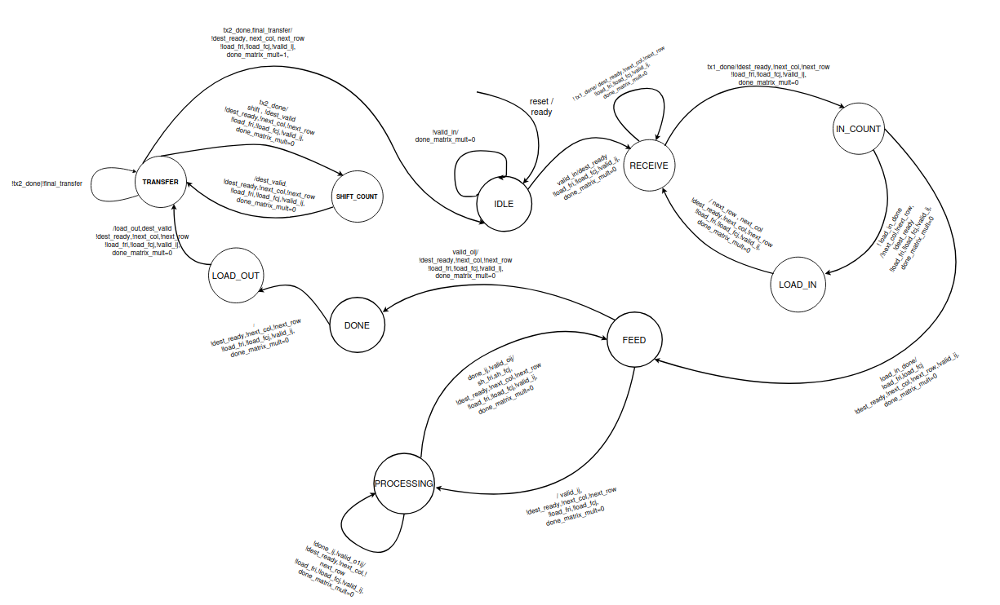  <!-- Replace with your image -->

### Explanation of States
#### I.IDLE:
- In this state, the processor is waiting for the valid_in signal.
- done_matrix_mult is 0 in this state.
#### II.RECEIVE:
- We reach this state when we get valid_in in the IDLE state.
- The dest_ready is set and we are waiting for a ready/valid handshake to occur.
- The handshake will occur when we receive the src_valid. It will be indicated by the tx1_done signal.
- When we receive the tx1_done signal, we will transition to the IN_COUNT state, else we will stay in RECEIVE state. 
#### III.IN_COUNT:
- In this state, the dest_ready is set to 0.
- This state is meant to count the number of tx1_done signals after the first transition.
- It allows the data to be arranged for loading into the appropriate registers.
#### IV.LOAD_IN:
- While the load_in_done sigal is not set, we will move into this state. Meaning that control only moves into this state if the loading operation is incomplete. 
- In this state, we wait for a cycle so that values get loaded into the appropriate registers. 
- Then we unconditionally move back to the RECEIVE state for further data. 
- During this transition to the RECEIVE state, it will set next_row and next_col to 1.
#### V.FEED:
- When the load_in_done signal is high in the IN_COUNT state, we transition into this state.
- In this state, all the load signals of the data feeders are set to 1, and hence it loads in the values and gives out 8-bits (MSBs) of data.
- After feeding, it unconditionally moves into the processing state, given that valid_o flag is not set.
- If the valid_o flag is set, we move to the DONE state.
#### VI.PROCESSING:
- In this state we wait till the done signals are set.
- The done signal will indicate the completion of a partial product.
- After receiving done signal, we move back to the FEED state.
- While moving into the FEED state, we set the shift signals of the feeders to 1 for a cycle, so that new elements are available to be fed into the chip.
#### VII.DONE:
- This state indicates the exit of the control from the systolic array and transitions into the LOAD_OUT state unconditionally. 
- While doing so, it causes the buffer to be store the value of the computed product.
#### VIII.LOAD_OUT:
- This state transitions into the TRANSFER state unconditionally.
- While this transition, it will set the load of the final feeder to 1 and also set the dest_valid.
#### IX.TRANSFER:
- In this state we are waiting for the ready/valid handshake to occur.
- The handshake only happens when the src_ready signal is received.
- When it will occur, we will get the tx2_done signal. And we will transition into the SHIFT_COUNT state. During that transition, shift of the datafeeder will be set to 1 for a cycle. The dest_valid is set to 0.
- Until we get the tx2_done signal, the control will stay in this state.
- When we get tx2_done signal and also the final_transfer signal, the control jumps back to idle, setting matrix_mult_done to 1 for a cycle, indicating that the final element has been transferred.
- It also sets next_row and next_col to 1 in order to reset by overflowing their respective counters.
#### X.SHIFT_COUNT:
- This state transitions back into the TRANSFER state unconditionally.
- The dest_valid is set to 1 during transition.

---

## (7) TESTING

We tested by six examples , two are shown below :

### Simulation:

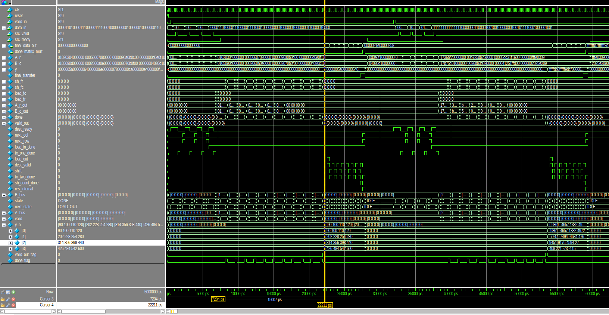

---
## (8) RESULT
## Transcript:
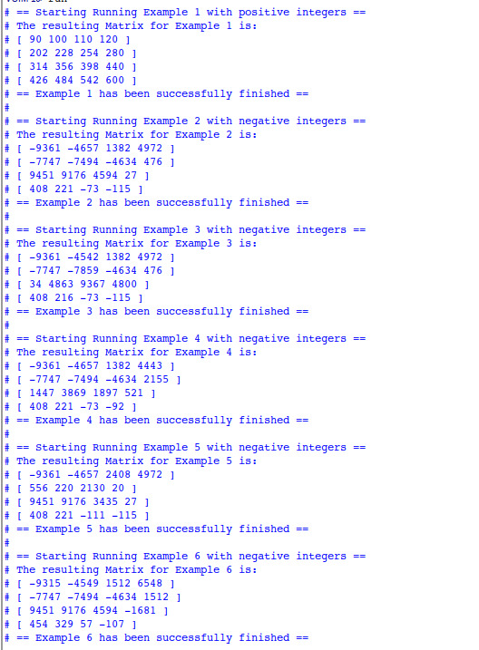
## Benchmarks
We used a custom benchmark written in C language, which multiplied two randomly generated 8 bit 4x4 matrices into 4x4 32 bit result. We ran it on different processors 6 times and took the average of the findings. The results are shown in the table below.  

| Processor   | Time (ns) (avg from 6 runs)  |
|---|---|
| M1  | 1000  |
| i7-1185G7  | 1239   |
| i7-1355U   | 715   |
| i5-10310U   | 1784    |
| i5-6300U   | 2455     |
| i7-8665U  | 1792 |
| *Systolic @ 3GHz* | *~15 (from simulation)*    |

Hence we observe that the systolic array is approximately **50-160** times faster than main-stream general purpose cpus. 

---

