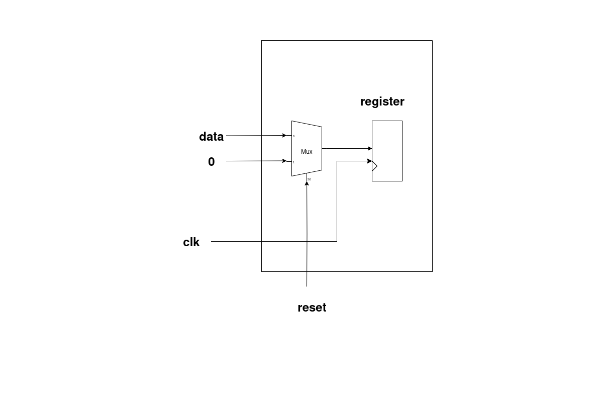

# 4x4 INT Systolic Architecture Based Accelerator for Efficient Matrix Multiplication

## Plan
The documentation is divided into two main sections:

- **User’s Guide**: Includes everything needed to *use* the chip.  
- **Developer’s Guide**: Contains complete details of the chip, including internal signals, STGs, diagrams, etc. This section is made so that anyone who wants to integrate the chip into their own design can do so using this documentation.  

---

## User Guide

  

- The array takes an **input of 64 bits** and gives an **output of 64 bits**.  
- This I/O is communicated using the **bidirectional ready-valid protocol**.  
- The bits have a predefined format according to which they are received/transmitted.  

**Input format:**  
- [63:32] → preformatted row (8 bits per element)
- [31:0] → preformatted column (8 bits per element)


**Output format:**  

[2 × (32-bit elements)]


---

### How to Give Input?
- Provide **four chunks of 64-bit input** where:  
  - `[63:32]` contains the *i-th row*  
  - `[31:0]` contains the *j-th column*  
- In this way, each row/column will be **32 bits**, and each element will be **8 bits** (since `8 × 4 = 32`).  
- These I/Os follow the **ready-valid protocol**:  
  - At the input end → **valid** is expected from the end user.  
  - At the output end → **ready** is expected from the end user.  

---

### Final Transfer
- Recognized with the **`done_matrix_multiplication` flag** being set.  
- This indicates:  
  1. The availability of the final two elements from the array.  
  2. The chip has returned to its **idle state** and is ready to accept new inputs.  

---

## Getting Started
Clone our repository:
```bash
git clone <your-repo-link>
```

# Developer’s Guide

---

## Conceptual Overview

### What is a Systolic Array?
- In parallel computer architectures, a **systolic array** is a homogeneous network of tightly coupled **data processing units (DPUs)** called *cells* or *nodes*.  
- Each node or DPU:
  - Independently computes a partial result as a function of the data received from its upstream neighbours.  
  - Stores the result within itself.  
  - Passes it downstream.  

📽️ *[Video clip placeholder — from presentation slides]*  

---

### Applications of Systolic Arrays
🔹 **Deep Learning Accelerators (ML)**  
Efficiently perform parallel matrix multiplications in neural networks like **CNNs** and **Transformers**.  

🔹 **Image & Signal Processing (DSP)**  
Enable real-time convolution operations for filtering, edge detection, and motion estimation.  

🔹 **DNA Sequence Alignment (Biology)**  
Accelerate alignment algorithms like **Smith-Waterman** using parallel dataflow for fast genome matching.  

🔹 **MIMO Signal Processing (DSP/Comms)**  
Support high-throughput matrix operations for channel equalization and beamforming in wireless systems.  

...and much more.  

---

## Main Parts of a Systolic Array

### 1. MAC Unit
- In computing, especially digital signal processing, the **Multiply–Accumulate (MAC)** or **Multiply–Add (MAD)** operation is a common step that:  
  - Computes the product of two numbers.  
  - Adds that product to an accumulator.  

- The MAC operation modifies an accumulator `y`:  
```math
y ← y + (a × b)
```

 For simplicity, in **C code**:  
```c
y += (a * b);
```

- General CPUs are used in **Von Neumann architecture**, but **digital signal processors (DSPs)** use **MACs**.  
- The hardware unit that performs the operation is known as a **Multiplier–Accumulator (MAC Unit)**.  

  <!-- Replace mac_unit.png with your actual file -->

## 2. Processing Elements / Data Processing Units

- A **Processing Element (PE)**, also called a **Data Processing Unit (DPU)**, is the fundamental building block of a systolic array.  
- Each PE is designed to perform simple operations such as:  
  - Addition  
  - Multiplication  
  - MAC (Multiply–Accumulate)  
- PEs are connected to their neighbors in a regular pattern, allowing data to **flow step by step**.  
- Together, many PEs work in parallel to achieve high throughput in matrix and vector computations.  

  <!-- Replace processing_element.png with your actual file -->

## 3. Systolic Array

- A **systolic array** is a grid of interconnected **Processing Elements (PEs)** arranged in rows and columns.  
- Data pulses rhythmically through the array like **blood through the heart** (hence the name *“systolic”*).  
- The structure enables efficient **parallel computation of linear algebra operations**, especially:  
  - Matrix multiplication  
  - Convolution  

  <!-- Replace systolic_array.png with your actual file -->


# OUR DESIGN

## Specialty & Performance

- We built the entire **Systolic Array** completely from scratch, covering all modules and interconnections.  
- On a **3 GHz machine**, the full computation completed in just **~15 ns**.  
- This results in a performance that is nearly **70× faster** than conventional implementations.  


---

# Explanation of Our Design

---

## (1) MAC Unit

### 1. PinOut
  <!-- Replace mac_pinout.png with your actual file -->

### Inputs
- Takes the following as inputs:  
  - **valid**  
  - **A** (8-bit element of matrix)  
  - **B** (8-bit element of matrix)  
  - **reset**  

### Outputs
- Provides the following as outputs:  
  - **y** → 32-bit result  
  - **done** → 1-bit signal which goes high whenever `y` is valid, indicating that the MAC unit has completed the operation.  

### 2. Design Diagram

  <!-- Replace mac_design.png with your actual file -->

### Explanation
- First of all, the user enters elements **A** and **B**.  
- As soon as **reset** is off and **valid** becomes high:  
  - `en_A` and `en_B` go high.  
  - The user-entered **A** and **B** values are stored in their respective registers: `reg_A` and `reg_B`.  
- Then:  
  - Both values are multiplied.  
  - The result is added to the previous result (principle of **MAC**).  
- A register named **reg_Acc** stores the result whenever `en_Acc` goes high.  
  - *(When `en_Acc` goes high will be explained in the STG section.)*  
- Since both input elements are **8 bits**:  
  - Multiplication produces a **16-bit** result.  
  - This result is padded to **32 bits** → giving output `y` as **32 bits**.  
- As soon as the result `y` is obtained, the **done** signal goes high.  


### 3. Register Design

  <!-- Replace register_design.png with your actual file -->

- This is the **general register design** used for all the registers in our system.  
- First, a **2×1 MUX** is used, whose output is stored into a register.  
- The **selector pin** of the MUX is `reset`.  
- Behavior:  
  - When **reset = 0 (off)** → The MUX selects input **data**, which is stored in the register. The corresponding `data_out` is available in the next cycle.  
  - When **reset = 1 (high)** → The MUX selects **zero**, and hence the register outputs `0` as `data_out`.  


### 4. State Transition Graph (STG)

  <!-- Replace mac_stg.png with your actual file -->

### Explanation

#### I. IDLE
- Whenever **reset = 1**, the system enters the **IDLE** state:  
  - All register enables are low.  
  - `done = 0`.  
- It **remains in IDLE** if `valid = 0`.  
- When a **valid** signal is received, it transitions to the **LOAD** state.  

#### II. LOAD
- In this state:  
  - Enables of **reg_A** and **reg_B** go high → user inputs are stored in `reg_A` and `reg_B`.  
  - **reg_Acc** is still off (no computation yet).  
  - `done = 0` since no result is available yet.  
- Next, it transitions to the **PROCESSING** state.  

#### III. PROCESSING
- In this state:  
  - **reg_A** and **reg_B** enables go low (to hold current inputs and avoid taking new ones).  
  - **reg_Acc** enable goes high → computation starts, and result is stored in the accumulator.  
  - `done = 0` since computation is still ongoing.  
- Next, it transitions to the **DONE** state.  

#### IV. DONE
- In this state:  
  - **en_A** and **en_B** remain off.  
  - **en_Acc** stays on.  
  - The **done signal = 1** → indicating completion of computation.  
- Finally, it transitions back to **IDLE**, and the cycle continues.  

---

## (2) PROCESSING ELEMENT (PE)

### PinOut:
![pe_PO]

**Inputs:**
- `valid`, `reset`, `A_in`, `B_in` as inputs.  
- `A_in`, `B_in` are 8-bit signals.  

**Outputs:**
- `A_out`, `B_out`, `done`, `valid_out`, `y_out`.  
- `A_out`, `B_out` are 8-bit signals.  
- `done` goes high whenever the MAC operation completes.  
- `valid_out` goes high whenever the overall PE operation completes.  
- `y_out` is the 32-bit output of the PE.  


