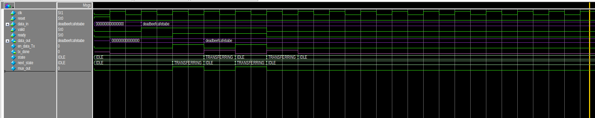

##  Interface 

#### 1. Interface Design Diagram
  <!-- Replace with your actual image -->

**Main Parts of Interface:**
1. **Ready-Valid Protocol**  
2. **Input Manager**  
3. **Output Manager**  

---
### EXPLANATION

### 1. READY-VALID PROTOCOL

#### PinOut

**Inputs:**
- `ready` – Indicates that the receiver is ready to accept data.  
- `valid` – Indicates that the sender has valid data.  
- `data_in` – 64-bit input data.  

**Outputs:**
- `data_out` – 64-bit output data.  
- `tx_done` – Goes high whenever `data_out` is successfully transmitted.  

### Design Diagram
  <!-- Replace with your actual image -->

### Explanation
- Whenever **valid** becomes high, `data_in` is received.  
- When both **valid** and **ready** are high:  
  - `en_data_Tx` goes high → handshaking occurs.  
  - `data_out` is produced in the next cycle (64 bits).  
- `tx_done` signal goes high whenever the respective `data_out` is available.  

#### How does `tx_done` work?
- `en_data_Tx` goes high when handshaking occurs.  
- A **multiplexer (MUX)** uses `en_data_Tx` as the select signal.  
  - When `en_data_Tx = 1`, the MUX outputs 1.  
  - This output passes through a **delay register**, producing `tx_done` in the next clock cycle.  

#### Why use a delay register?
- Without the delay register, `tx_done` would assert **one cycle earlier** than the availability of `data_out`.  
- The delay register ensures `tx_done` aligns with the exact cycle when `data_out` is valid, confirming the output data is ready.  

### State Transition Graph (STG)
.png)  <!-- Replace with your actual image -->

### Explanation

#### I. IDLE
- On **reset**, the system enters the **IDLE** state.  
- If either `valid` or `ready` is low, the system **remains in IDLE**.  
- When both `valid` and `ready` are high, **handshaking occurs**, and the system transitions to the **Tx** state.  

#### II. Tx
- In this state, `valid` and `ready` being high indicate that **handshaking has occurred**.  
- The `en_data_Tx` signal is asserted (goes high), initiating the **data transfer**.  
- Immediately after this, the system **returns to the IDLE** state.  

### Simulations:

---

### 2. INPUT MANAGER

#### PinOut
.png)

**Inputs:**
- `data_in` – 64-bit input data.  
- `next_row` – Signal to indicate the next row of the matrix.  
- `next_col` – Signal to indicate the next column of the matrix.  

**Outputs:**
- `A_r1`, `A_r2`, `A_r3`, `A_r4` – 56-bit outputs for rows 1 to 4.  
- `B_c1`, `B_c2`, `B_c3`, `B_c4` – 56-bit outputs for columns 1 to 4.  
  - Each row/column has **7 elements**, and each element is **8 bits** → 7 × 8 = 56 bits.  

**Working:**  
- The Input Manager is **combined with the input datapath**, which is explained in the following section.  

---

### 3. OUTPUT MANAGER

#### PinOut
.png)

**Inputs:**
- `load` – Signal to load the input data.  
- `shift` – Signal to shift the data.  
- `reset` – Resets the internal state of the output manager.  
- `data_in` – 512-bit input data (`y` from processing elements).  

**Outputs:**
- `data_out` – 64-bit output data, produced **eight times** from the 512-bit input.  

### Design Diagram
.png)

### Explanation
- The **Systolic Array** produces **512 bits** output (16 PEs × 32 bits each).  
- These 512 bits serve as `data_in`/`y` for the **Output Manager**.  
- The Output Manager acts like a **data feeder**, mainly implemented as a **shift register**.  
- The **first 64 bits** are taken from the **MSB side** when `load` is high.  
- For the remaining seven 64-bit chunks:  
  - Wait for the `shift` signal.  
  - Each time `shift` goes high, the next 64-bit chunk is produced as `data_out`.  
- In this way, the **eight 64-bit outputs** are obtained sequentially.  

---
