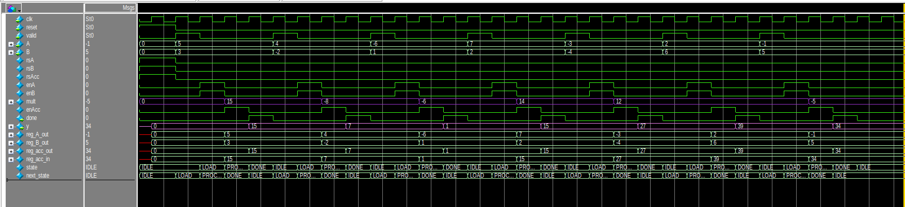

##  MAC Unit

### 1. PinOut
.png)  <!-- Replace mac_pinout.png with your actual file -->

### Inputs
- Takes the following as inputs:  
  - **valid**  
  - **A** (8-bit element of matrix)  
  - **B** (8-bit element of matrix)  
  - **reset**  

### Outputs
- Provides the following as outputs:  
  - **y** → 32-bit result  
  - **done** → 1-bit signal which goes high whenever `y` is valid, indicating that the MAC unit has completed the operation.  

### 2. Design Diagram

.png)  <!-- Replace mac_design.png with your actual file -->

### Explanation
- First of all, the user enters elements **A** and **B**.  
- As soon as **reset** is off and **valid** becomes high:  
  - `en_A` and `en_B` go high.  
  - The user-entered **A** and **B** values are stored in their respective registers: `reg_A` and `reg_B`.  
- Then:  
  - Both values are multiplied.  
  - The result is added to the previous result (principle of **MAC**).  
- A register named **reg_Acc** stores the result whenever `en_Acc` goes high.  
  - *(When `en_Acc` goes high will be explained in the STG section.)*  
- Since both input elements are **8 bits**:  
  - Multiplication produces a **16-bit** result.  
  - This result is padded to **32 bits** → giving output `y` as **32 bits**.  
- As soon as the result `y` is obtained, the **done** signal goes high.  

### Simulations:

### 3. Register Design

  <!-- Replace register_design.png with your actual file -->

- This is the **general register design** used for all the registers in our system.  
- First, a **2×1 MUX** is used, whose output is stored into a register.  
- The **selector pin** of the MUX is `reset`.  
- Behavior:  
  - When **reset = 0 (off)** → The MUX selects input **data**, which is stored in the register. The corresponding `data_out` is available in the next cycle.  
  - When **reset = 1 (high)** → The MUX selects **zero**, and hence the register outputs `0` as `data_out`.  

### 4. State Transition Graph (STG)

.png)  <!-- Replace mac_stg.png with your actual file -->

### Explanation

#### I. IDLE
- Whenever **reset = 1**, the system enters the **IDLE** state:  
  - All register enables are low.  
  - `done = 0`.  
- It **remains in IDLE** if `valid = 0`.  
- When a **valid** signal is received, it transitions to the **LOAD** state.  

#### II. LOAD
- In this state:  
  - Enables of **reg_A** and **reg_B** go high → user inputs are stored in `reg_A` and `reg_B`.  
  - **reg_Acc** is still off (no computation yet).  
  - `done = 0` since no result is available yet.  
- Next, it transitions to the **PROCESSING** state.  

#### III. PROCESSING
- In this state:  
  - **reg_A** and **reg_B** enables go low (to hold current inputs and avoid taking new ones).  
  - **reg_Acc** enable goes high → computation starts, and result is stored in the accumulator.  
  - `done = 0` since computation is still ongoing.  
- Next, it transitions to the **DONE** state.  

#### IV. DONE
- In this state:  
  - **en_A** and **en_B** remain off.  
  - **en_Acc** stays on.  
  - The **done signal = 1** → indicating completion of computation.  
- Finally, it transitions back to **IDLE**, and the cycle continues.  

---
