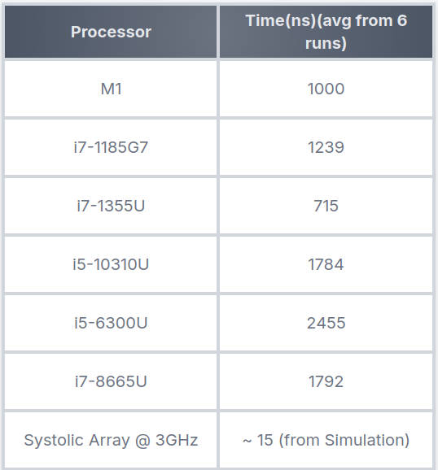

##  RESULT
## Transcript:

## Benchmarks
We used a custom benchmark written in C language, which multiplied two randomly generated 8 bit 4x4 matrices into 4x4 32 bit result. We ran it on different processors 6 times and took the average of the findings. The results are shown in the table below.  

Hence we observe that the systolic array is approximately **50-160** times faster than main-stream general purpose cpus. 

---
